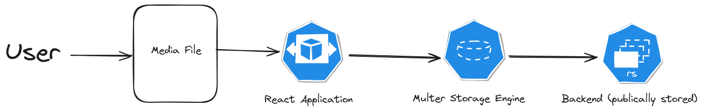

# PlayIt

PlayIt is a media upload and streaming platform that enables users to upload, store, and stream media files through an intuitive and modern web interface.

---

## Architecture

**Workflow:**

- The user uploads a media file via the React application.
- The frontend sends the file using Multer storage middleware.
- The backend receives and publicly stores the file, making it available for instant streaming.

---

## Features

- Upload and stream media files instantly
- Modern user interface built with React
- Efficient file handling using Multer and Node.js
- MongoDB-powered backend for scalability
- Full Docker-based deployment
- Public media repository with REST API

---
## Tech Stack
- **Frontend:** React.js (JavaScript)
- **Backend:** Node.js, Express.js
- **File Uploads:** Multer (middleware for handling multipart/form-data)
- **Database:** MongoDB (NoSQL document store)
- **Containerization & Orchestration:** Docker, Docker Compose
- **Cloud Deployment:** Vercel/Netlify for frontend, any Node.js-compatible cloud provider for backend

## Setup

### Prerequisites

- Node.js (v14+)
- npm or yarn
- Docker & Docker Compose

---

### Local Development

#### Frontend

cd frontend && npm install
npm start

text

#### Backend

cd backend && npm install
npm start

text

---

### Docker Deployment

You can launch the entire application stack using Docker Compose:

Create a `docker-compose.yml` file in your project root:

## Usage

- Open [http://localhost:3000](http://localhost:3000) in your browser.
- Register and log in.
- Upload media and start streaming!

---

## Deployment

The frontend can be deployed with Vercel or Netlify, and the backend on any cloud provider supporting Node.js.

**Live Demo:** [play-it-tan.vercel.app](https://play-it-tan.vercel.app)

---

## Contributing

Pull requests and contributions are always welcome! Please open issues for suggested features or to report bugs.

---

(Add your preferred open-source license here.)

---

## Maintainer

[Navya Verma](https://github.com/Navya-Verma11)
